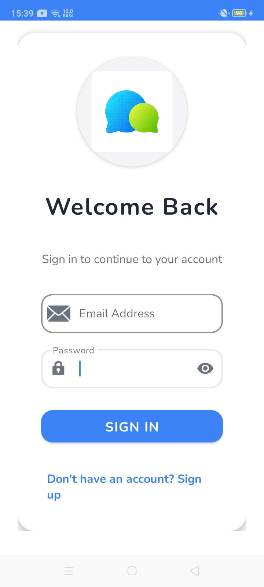
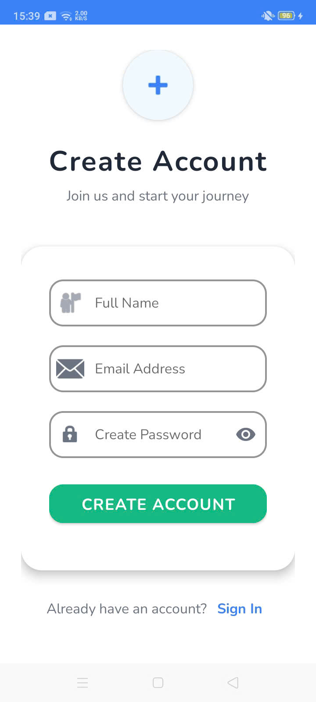
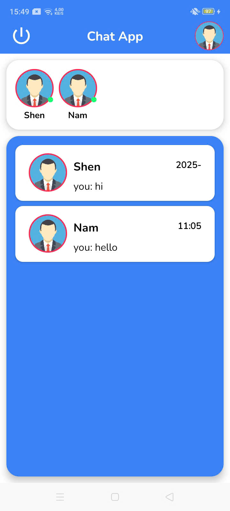
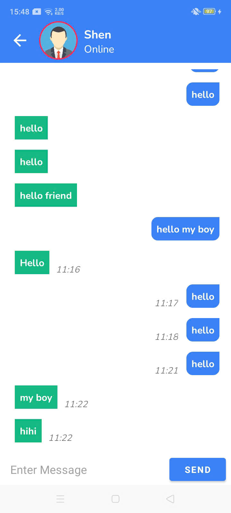
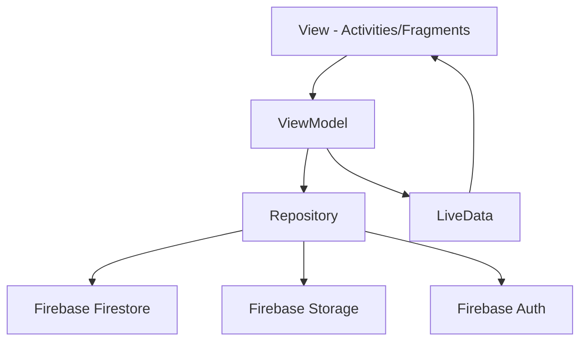

<div align="center">

# 💬 ChatMessenger
### Ứng Dụng Nhắn Tin Thời Gian Thực

<p>
  
  
  
  
</p>

**Developed with ❤️ by Bùi Trung Dũng - 2025**


</div>

---

## 📖 Giới thiệu

ChatMessenger là ứng dụng nhắn tin **thời gian thực** được phát triển bằng **Kotlin** với **Firebase** backend. Ứng dụng mang đến trải nghiệm chat **mượt mà**, **hiện đại** và hoàn toàn **Việt hóa**.

<div align="center">

### 🎯 Tính năng chính

</div>

<table>
<tr>
<td width="33%" align="center">

### 🔐 **Xác thực**
- Đăng ký/Đăng nhập Firebase
- Bảo mật cao
- Quản lý phiên

</td>
<td width="33%" align="center">

### 💬 **Chat Realtime**
- Tin nhắn tức thì
- Hiển thị thời gian
- Auto scroll

</td>
<td width="33%" align="center">

### 👤 **Profile**
- Upload avatar
- Cập nhật thông tin
- Trạng thái online

</td>
</tr>
</table>

---

## 📱 Screenshots

<div align="center">
<table>
<tr>
<td align="center" width="25%">
<br>
<b>🔑 Đăng nhập</b>
</td>
<td align="center" width="25%">
<br>
<b>👥 Đăng ký</b>
</td>
<td align="center" width="25%">
<br>
<b>Giao diện chính</b>
</td>
<td align="center" width="25%">
<br>
<b>💬 Giao diện chat</b>
</td>
</tr>
</table>
</div>

---

## 🛠️ Tech Stack

<div align="center">

### Backend & Database
[](https://firebase.google.com/)
[](https://firebase.google.com/products/firestore)
[](https://firebase.google.com/products/storage)

### Architecture & Patterns
[](https://developer.android.com/jetpack/guide)
[](https://developer.android.com/jetpack/guide)
[](https://developer.android.com/topic/libraries/architecture/livedata)

### UI & Libraries
[](https://material.io/design)
[](https://github.com/bumptech/glide)
[](https://developer.android.com/guide/navigation)

</div>

---

## 🏗️ Architecture

<div align="center">



</div>

<details>
<summary><b>📁 Cấu trúc project</b></summary>

```
📦 com.example.chatmessenger
├── 🎭 activities/
│   ├── SignInActivity.kt      # 🔑 Đăng nhập
│   ├── SignUpActivity.kt      # 📝 Đăng ký  
│   └── MainActivity.kt        # 🏠 Activity chính
├── 🧩 fragments/
│   ├── HomeFragment.kt        # 👥 Danh sách user
│   ├── ChatFragment.kt        # 💬 Chat 1-1
│   ├── ChatfromHome.kt        # 📋 Chat từ recent
│   └── SettingFragment.kt     # ⚙️ Cài đặt
├── 🔗 adapter/
│   ├── UserAdapter.kt         # Adapter user list
│   └── MessageAdapter.kt      # Adapter tin nhắn
├── 📊 modal/
│   ├── Users.kt              # Model người dùng
│   ├── Messages.kt           # Model tin nhắn
│   └── RecentChats.kt        # Model chat gần đây
├── 🏛️ mvvm/
│   ├── UsersRepo.kt          # Repository Users
│   ├── MessageRepo.kt        # Repository Messages
│   └── ChatAppViewModel.kt   # ViewModel chính
└── 🛠️ Utils.kt               # Tiện ích
```

</details>

---

## 🔥 Firebase Schema

<details>
<summary><b>📊 Cấu trúc dữ liệu</b></summary>

### 👤 Collection: `Users`
```json
{
  "uid": "user_unique_id",
  "username": "Bùi Trung Dũng", 
  "email": "dungbui0403@gmail.com",
  "imageUrl": "https://firebasestorage.googleapis.com/...",
  "status": "online"
}
```

### 💌 Collection: `Messages`
```json
{
  "sender": "sender_uid",
  "receiver": "receiver_uid", 
  "message": "Nội dung tin nhắn",
  "time": "2025-01-20 14:30:25"
}
```

### 📋 Collection: `RecentChats`
```json
{
  "friendid": "friend_uid",
  "name": "Tên bạn bè",
  "friendsimage": "https://...",
  "lastmessage": "Tin nhắn cuối cùng",
  "time": "2025-01-20 14:30:25"
}
```

</details>

---

## ⚡ Features

<div align="center">

| Feature | Status | Description |
|---------|--------|-------------|
| 🔐 **Authentication** | ✅ | Firebase Auth - Email/Password |
| 💬 **Real-time Chat** | ✅ | Instant messaging với Firestore |
| 📱 **Responsive UI** | ✅ | Material Design, Dark/Light theme |
| 📸 **Image Upload** | ✅ | Camera + Gallery → Firebase Storage |
| 👥 **User Management** | ✅ | User list, search, status |
| 🔍 **Search** | ✅ | Tìm kiếm người dùng |
| ⏰ **Timestamps** | ✅ | Hiển thị thời gian tin nhắn |
| 📜 **Recent Chats** | ✅ | Danh sách cuộc trò chuyện gần đây |

</div>

---

## 🚀 Getting Started

### 📋 Requirements
- **Android Studio**: Arctic Fox+
- **Minimum SDK**: API 21 (Android 5.0)
- **Target SDK**: API 34 (Android 14)
- **Kotlin**: 1.8.0+

### ⚙️ Setup

<details>
<summary><b>1. 📥 Clone Repository</b></summary>

```bash
git clone [your-repository-url]
cd ChatMessenger
```

</details>

<details>
<summary><b>2. 🔥 Firebase Setup</b></summary>

1. Tạo project trên [Firebase Console](https://console.firebase.google.com/)
2. Thêm Android app với package: `com.example.chatmessenger`
3. Download `google-services.json` → `app/` folder
4. Enable:
   - 🔐 **Authentication** (Email/Password)
   - 🗄️ **Firestore Database**
   - 📁 **Storage**

</details>

<details>
<summary><b>3. 🔨 Build & Run</b></summary>

```bash
# Build project
./gradlew build

# Install on device
./gradlew installDebug
```

</details>

---

## 🎯 Highlights

<div align="center">

### 🚀 Performance
- RecyclerView với ViewHolder pattern
- Glide image caching
- Optimized Firestore queries
- Lazy loading messages

### 🎨 UI/UX
- Material Design 3
- Smooth animations
- Responsive layouts
- Vietnamese localization

### 🔒 Security
- Firebase Auth security
- Firestore security rules
- Storage access control

</div>

---

## 👨‍💻 Developer

<div align="center">

### **Bùi Trung Dũng**

[](mailto:dungbui0403@gmail.com)
[](#)
[](#)

</div>

---

## 📄 License

Dự án này được phát triển cho mục đích **học tập** và **nghiên cứu**.

---

<div align="center">

### 🙏 Cảm ơn

Cảm ơn cộng đồng **Android Developer** và các nguồn tài liệu mã nguồn mở.

---

**Made with ❤️ and ☕ by Dũng**


</div>
